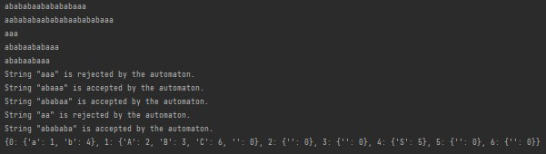

# Topic: Intro to formal languages. Regular grammars. Finite Automata.
## Course: Formal Languages & Finite Automata
## Author: Nistor Stefan FAF-211
Variant 18:

VN={S, A, B, C}, 

VT={a, b}, 

P={ 
    S → aA     
    A → bS    
    S → aB   
    B → aC    
    C → a  
    C → bS
}

## Theory
Formal languages are a way to represent and describe sets of strings using a set of rules or symbols. Formal languages can be classified into different types based on their properties.
Finite automata are computational models that operate by following a set of rules to process strings.
The basic idea behind them is to read an input string, and transition between states based on the current input character and the current state, and it designed to accept or reject the string based on the set of rules.
## Objectives:
- Understand what a language is and what it needs to have in order to be considered a formal one.

- Provide the initial setup for the evolving project:

    a. Create a local && remote repository of a VCS hosting service

    b. Choose a programming language

    c. Create a separate folder the report will be kept

- According to my variant 6, get the grammar definition and do the following tasks:

    a. Implement a type/class for the grammar;

    b. Add one function that would generate 5 valid strings from the language expressed by the given grammar

    c. Implement some functionality that would convert and object of type Grammar to one of type Finite Automaton;

    d. For the Finite Automaton, add a method that checks if an input string can be obtained via the state transition from it
## Implementation description
### GenerateString
- The function recursively generates a string by applying the grammar rules associated with the given non-terminal symbol.
- It initializes an empty StringBuilder to build the final output string and a list of possible productions that have the given symbol as their left-hand side.
- The function then selects a random production from the list and retrieves the right-hand side of the selected production.
- It loops through each character in the right-hand side string and either recursively calls itself with the non-terminal character or appends the character to the StringBuilder, depending on whether the character is a non-terminal symbol or a terminal symbol, respectively.
- Finally, the function returns the contents of the StringBuilder as a string, which represents the output string generated by applying the grammar rules associated with the given non-terminal symbol.

```python
    def generate_string(self):
        # Generate a string from the start symbol using the internal recursive method
        return self._generate_string(self.start_symbol)

    def _generate_string(self, symbol):
        # If the current symbol is a terminal symbol, return it
        if symbol not in self.productions:
            return symbol
        # Otherwise, choose a random production for the current symbol and recursively generate a string from each symbol in the production
        production = random.choice(self.productions[symbol])
        return ''.join(self._generate_string(s) for s in production)
```
### toFiniteAutomaton
- The method converts a context-free grammar into a finite automaton.

- It constructs the set of possible states by taking the union of non-terminal variables with the final state 'X'.

- The method defines the alphabet as the set of terminal variables.

- It constructs the set of transitions by mapping the productions of the grammar to transitions in the finite automaton.

- The method sets the initial state to be the starting character of the grammar and the final state to be 'X'.

- Finally, the method returns a new instance of a FiniteAutomaton class, which represents the converted grammar as a finite automaton.

```python
 def to_finite_automaton(self):
        # Initialize the finite automaton with a start state
        start_state = 0
        automatons = {start_state: {}}
        state_count = 1

        # Iterate over each symbol in the productions dictionary
        for symbol in self.productions:
            # Iterate over each production for the current symbol
            for production in self.productions[symbol]:
                current_state = start_state
                # For each symbol in the production, create a new state if necessary and add a transition to the finite automaton
                for s in production:
                    if s not in automatons[current_state]:
                        automatons[current_state][s] = state_count
                        automatons[state_count] = {}
                        state_count += 1
                    current_state = automatons[current_state][s]
                # Add an epsilon transition from the final state of the production to the start state of the finite automaton
                if current_state not in automatons:
                    automatons[current_state] = {}
                automatons[current_state][''] = start_state

        # Return the resulting finite automaton
        return automatons
```

### CheckString

- The method checks if a given input string is a valid word of the grammar by simulating the non-deterministic finite automaton that recognizes the grammar.

- It uses a set of current states, initially set to the epsilon closure of the initial state, to track the possible states that the automaton could be in after reading the first character of the input string.

- The method loops through each character of the input string and updates the set of possible states based on the transitions from the current states that consume the current character.

- If the set of possible states is empty at any point, the method returns false.

- After processing the entire input string, the method checks if any of the final states of the automaton are present in the set of possible states, and returns true if a final state is found, and false otherwise.

```python
    def check_string(self, string):
        # Sets the current state to the start state of the automaton.
        current_state = self.start_state

        # Iterates over each symbol in the input string.
        for symbol in string:
            try:
                # Uses the transition function to determine the next state of the automaton.
                current_state = self.transition[current_state][symbol]
            except KeyError:
                # If there is no valid transition for the current state and input symbol, the string is rejected.
                return False

        # If the final state is in the set of final states, the string is accepted.
        return current_state in self.final_states

    # Checks a list of strings for acceptance by the finite automaton.
    def check_strings(self, strings):
        # Iterates over each string in the input list.
        for string in strings:
            if self.check_string(string):
                # If the string is accepted, prints a message indicating so.
                print(f'String "{string}" is accepted by the automaton.')
            else:
                # If the string is rejected, prints a message indicating so.
                print(f'String "{string}" is rejected by the automaton.')
```


## Results


## Conclusions
In conclusion, after I did this lab work I can say that I was able to gain a better understanding of formal languages and implement a grammar in code.
I created a class grammar that is responsible for generating a word from the given variables and the grammar into a finite automaton. The class Production is a builder for the class Grammar. The class FiniteAutomaton is responsible for checking if the generated word is corresponding to the rules. The class Transition is responsible for keeping the current and next state, a helper for the FiniteAutomaton class. In class Tools, I created the function generateRandomString() that generates a random  and I use it for checking if the automaton works.       