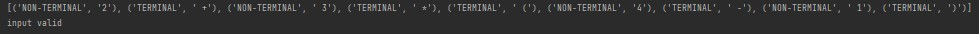
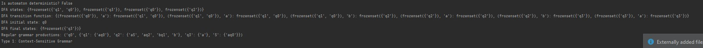

# Determinism in Finite Automata. Conversion from NFA to DFA. Chomsky Hierarchy.
## Course: Formal Languages & Finite Automata
## Author: Nistor Stefan FAF-211
Variant 18

Q = {q0,q1,q2,q3},

∑ = {a,b,c},

F = {q3},

δ(q0,a) = q0,

δ(q0,a) = q1,

δ(q1,b) = q2,

δ(q2,a) = q2,

δ(q3,a) = q3,

δ(q2,b) = q3.  


## Theory
A finite automaton is a device utilized to depict various kinds of processes, similar to a state machine in terms of its structure and purpose. The term "finite" denotes that an automaton possesses a starting state and a set of final states, meaning that any process modeled by an automaton has a clear beginning and end.
Depending on the structure of the automaton, there may be cases where a single transition leads to multiple states, resulting in non-determinism. Determinism refers to how predictable a system is when discussing systems theory. When there are random variables present, the system becomes non-deterministic or stochastic.
As a result, automata can be categorized as either deterministic or non-deterministic, and it is possible to achieve determinism by utilizing algorithms that alter the automaton's structure.
Chomsky Hierarchy is a system of classifying formal languages into four categories based on the complexity of their grammars:
- Regular languages
- Context-free languages
- Context-sensitive languages
- Recursively enumerable languages

A non-deterministic finite automaton NFA is a type of finite automaton that can have multiple transitions for a given input symbol from a particular state. In contrast, a deterministic finite automaton DFA is a type of finite automaton that has only one transition for a given input symbol from a particular state.
To convert an NFA to a DFA, we need to create a new DFA that accepts the same language as the NFA. We create a state in the DFA for each possible combination of states in the NFA. The transitions between states in the DFA are determined by examining the possible transitions from each state in the NFA for each input symbol. If a set of states in the NFA includes a final state, then the corresponding state in the DFA is also a final state.
## Objectives:
- Understand what an automaton is and what it can be used for.

- Continuing the work in the same repository and the same project, the following need to be added:

  a. Provide a function in your grammar type/class that could classify the grammar based on Chomsky hierarchy.

  b. For this you can use the variant from the previous lab.

- According to your variant number (by universal convention it is register ID), get the finite automaton definition and do the following tasks:

  a. Implement conversion of a finite automaton to a regular grammar.

  b. Determine whether your FA is deterministic or non-deterministic.

  c. Implement some functionality that would convert an NDFA to a DFA.

  d. Represent the finite automaton graphically:
    - You can use external libraries, tools or APIs to generate the figures/diagrams.
    - Your program needs to gather and send the data about the automaton and the lib/tool/API return the visual representation.

## Implementation description
### isDeterministic
This code checks whether the finite automaton represented by the object is deterministic or not. It does so by creating a transition map that maps the current state and input symbol to a set of next states. If any state in the automaton has multiple transitions for the same input symbol, then the automaton is non-deterministic and the method returns false. Otherwise, the automaton is deterministic and the method returns true. The method takes no arguments and returns a boolean value.

```python
 def is_deterministic(self):
        # Checks if the automaton is deterministic
        for state in self.states:
            for symbol in self.alphabet:
                next_states = self.transitions.get((state, symbol), set())
                if len(next_states) != 1:
                    return False
        return True
```
### convertToDFA
This code converts a non-deterministic finite automaton NFA to a deterministic finite automaton DFA. It does so by creating a power set of all possible states of the NFA, creating a new DFA transition table, and then using the transition table to create the DFA.
The method creates a power set of all possible states of the NFA by calling the "getPowerSet" method, which returns a set of sets representing all possible combinations of states. The method then creates a new DFA transition table by iterating over all state sets in the power set and creating a set of next states for each symbol in the alphabet by examining the possible transitions from each state in the current state set for each input symbol. Finally, the method creates a new DFA by initializing the new DFA with the transition table, final states, and initial state.

```python
     def to_dfa(self):
        # Converts the automaton to a deterministic finite automaton (DFA)
        if self.is_deterministic():
            return self

        dfa_states = set()
        dfa_accept_states = set()
        dfa_transitions = dict()
        state_queue = [frozenset([self.start_state])]
        while state_queue:
            current_states = state_queue.pop(0)
            dfa_states.add(current_states)
            if any(state in self.accept_states for state in current_states):
                dfa_accept_states.add(current_states)
            for symbol in self.alphabet:
                next_states = set()
                for state in current_states:
                    next_states |= set(self.transitions.get((state, symbol), set()))
                if next_states:
                    next_states = frozenset(next_states)
                    dfa_transitions[(current_states, symbol)] = next_states
                    if next_states not in dfa_states:
                        state_queue.append(next_states)

        dfa = Automaton()
        dfa.states = dfa_states
        dfa.accept_states = dfa_accept_states
        dfa.transitions = dfa_transitions
        return dfa
```

### Chomsky Clasification
The chomsky_classification method checks whether the given grammar is in Chomsky Normal Form (CNF) and returns the type of the grammar based on Chomsky's hierarchy. It checks each production in the grammar to see if it meets the requirements of CNF, which are that each production must either be a single terminal symbol, a pair of nonterminal symbols, or a production that produces the empty string. If a production does not meet these requirements, the method returns the type of the grammar according to Chomsky's hierarchy. If the start symbol has a production that only consists of the empty string, the method checks if there are any other productions for the start symbol to determine the type of the grammar. If the start symbol does not have a production that only consists of the empty string, the grammar is considered context-free. Based on these checks, the method returns one of the four types of grammar in Chomsky's hierarchy: Type 0 (Unrestricted Grammar), Type 1 (Context-Sensitive Grammar), Type 2 (Context-Free Grammar), and Type 3 (Regular Grammar).


```python
 def chomsky_classification(self):
        # Check if each production in the grammar is in Chomsky normal form
        for symbol, productions in self.productions.items():
            for production in productions:
                # If the production is a single terminal symbol, it's in CNF
                if len(production) == 1 and production.islower():
                    continue
                # If the production is a pair of nonterminal symbols, it's in CNF
                elif len(production) == 2 and production.isupper():
                    continue
                # If the production is a single nonterminal symbol, it's not in CNF
                elif len(production) == 1 and production.isupper():
                    return "Type 0: Unrestricted Grammar"
                # If the production is not a pair of nonterminal symbols or a single terminal symbol, it's not in CNF
                elif len(production) != 2 or not production.isupper():
                    return "Type 1: Context-Sensitive Grammar"

        # Check if the start symbol has a production that only consists of the empty string
        if self.start_symbol in self.productions and 'ε' in self.productions[self.start_symbol]:
            # If there are any other productions for the start symbol, the grammar is not in CNF
            if len(self.productions[self.start_symbol]) > 1:
                return "Type 2: Context-Free Grammar"
            # If there are no other productions for the start symbol, the grammar is in CNF
            else:
                return "Type 3: Regular Grammar"
        # If the start symbol doesn't have a production that only consists of the empty string, the grammar is not in CNF
        else:
            return "Type 2: Context-Free Grammar"
```
### Render function

The render function takes a deterministic finite automaton (DFA) object and uses the networkx and matplotlib libraries to visualize it as a directed graph. It creates a directed graph using the networkx library and adds nodes for each state in the DFA, with the start state and accept states having different shapes. It then adds edges to the graph to represent transitions between states and labels the edges with the symbols that trigger the transitions. Finally, it sets up positions for the nodes using networkx's spring_layout algorithm and draws the graph using matplotlib. The resulting visualization shows the states of the DFA and the transitions between them.


## Results


## Conclusions
In conclusion, after I did this lab work I can say that I was able to gain a better understanding of determinism in Finite Automata, conversion from NFA to DFA and Chomsky Hierarchy.
In class FiniteAutomaton I created the methods convertToRegularGrammar, isDeterministic, convertToDFA, getPowerSet, transitionsFrom. In class Grammar I added the methods classifyGrammar, isRegularGrammar, isContextFreeGrammar, isContextSensitiveGrammar. 